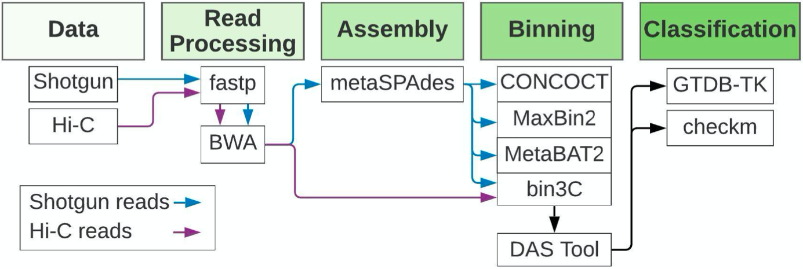
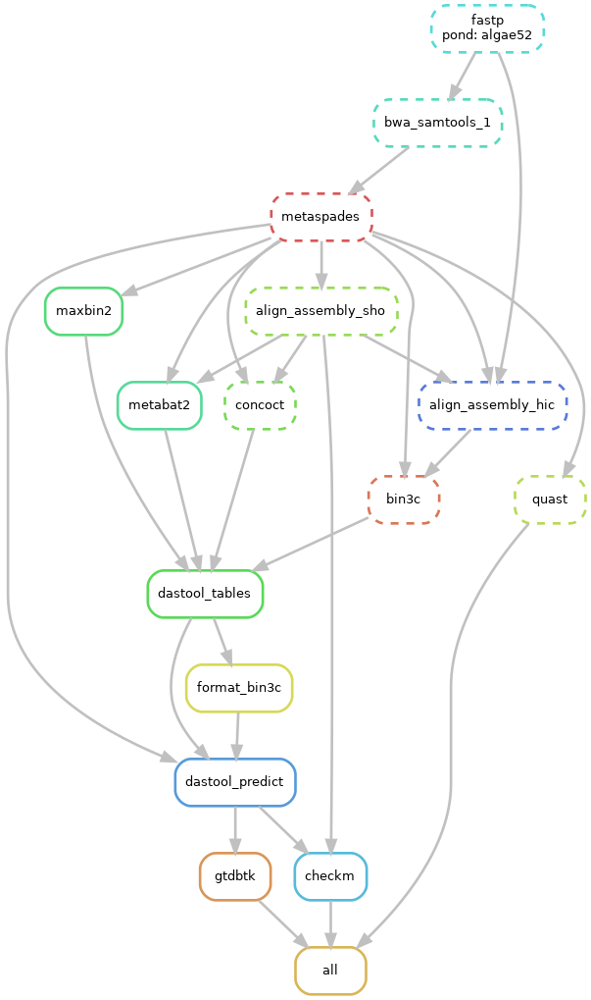

# Metagenomic pipeline using Shotgun and Hi-C reads

This pipeline is based in Snakemake and analyzes a multi-sample metagenomic dataset of FASTQ reads, ultimately outputting graphs of both the taxonomic community profile and percentage abundances of species present. 

## Motivation

Metagenomics poses unique and challenging problems in comparison to the standard study of single organism datasets, for which most sequencing platforms are designed. Hi-C proximity ligation sequencing allows for improved deconvolution of metagenomic sequencing data by providing information about the co-localization of sequences within a single cell. This pipeline combines both short-read sequencing reads and Hi-C sequencing reads to accurately profile species present in multiple samples.

## Repository contents

Both a pipeline usable for other metagenomic datasets as well as an example pipeline that has successfully run are included in this repo. The UI for the generalized pipeline allows for input of the number of samples, the conditions of each sample, and the types of read data. The user will be able to recreate a similar metagenomic analysis by downloading the Snakemake pipeline and the required environments.

## Example data overview

The data used in this pipeline consists of four samples of FASTQ read data of the algal species *Nannochloropsis oceanica*. *N. oceanica* is of significant interest as an alternative energy source due to its high lipid content and minimal growth requirements. However, *N. oceanica* is easily susceptible to infection by microscopic pathogen(s) that are not yet identified. By using metagenomic techniques and leveraging the increased deconvolutional power of Hi-C, we can identify the organisms present in algal ponds. We are studying four samples, two of which represent healthy ponds, and two that represent sick ponds that are no longer viable for energy production. In this project we aim to identify the species present in each of the ponds, and upon comparison of the healthy and sick ponds, identify the possible pathogen(s).

### Pipeline

Our Snakemake pipeline processes FASTQ reads from both Illumina short-read sequencing and Hi-C sequencing to determine taxonomic and species abundances in each sample. The pipeline is divided into five main steps: Data, Read Processing, Assembly, Binning, Classification. The boxes under each step show the tools used. In addition, after classification, we developed an R Shiny script to visualize our results. A visual representation of our pipeline is shown below.

## Example output

A DAG is automatically produced through Snakemake. The DAG for the *N. oceanica* metagenomic pipeline is shown below, featuring only one of our samples, 

## Acknowledgements

All FASTQ data is provided by Los Alamos National Lab through the University of Arizona. This project was created at the University of Oregon. 
